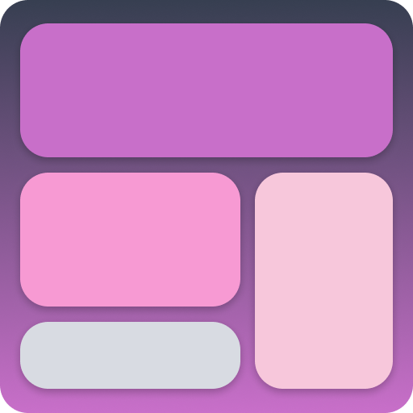

<p align="center">
    
    <h2 align="center">Common Media Queries</h2>
</p>

## 🌻 Motivation

Sometimes you are caught because can't remember the basic media queries? Not any more! Common Media Queries is a group of simple Media Queries ready to use with CSS and SCSS.

## ⚡ Features

Just type:

```
@
```


## 📈 Breakpoints most used

<div id="all-resolution-ww-monthly-202010-202207" width="600" height="400" style="width:600px; height: 400px;"></div><!-- You may change the values of width and height above to resize the chart --><p>Source: <a href="https://gs.statcounter.com/screen-resolution-stats#monthly-202010-202207-bar">StatCounter Global Stats - Screen Resolution Market Share</a></p><script type="text/javascript" src="https://www.statcounter.com/js/fusioncharts.js"></script><script type="text/javascript" src="https://gs.statcounter.com/chart.php?all-resolution-ww-monthly-202010-202207&chartWidth=600"></script>

## 👷 The author


